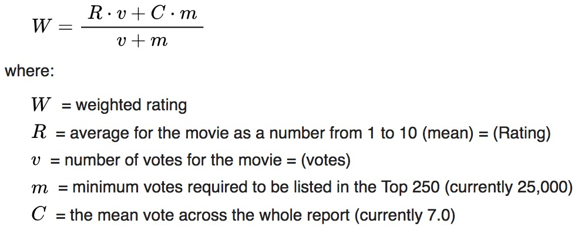

# What2watch-Movie-Search-and-Recommendation-System
[Jiazheng Li](https://github.com/uuvkk) (jl46), [Keren Wang](URL) (wkeren2) and [Yunwen Zhu](URL) (yunwenz2)

## Dataset
Open source data from Kaggle, you can download the dataset [here](https://www.kaggle.com/rounakbanik/the-movies-dataset). It contains information like title, year, description, producer and actors of more than 45,000 movies, and 26 million ratings from 270,000 users for the 45,000 movies. 

## Libraries and Techniques Used in thie Project
MeTApy for searching and ranking, text mining

Pandas for processing the data files

PyQt5 for creating GUI for users

## Main Classes and Functions
### Dat File Creator
To use MeTApy library, we must use MeTA-readable file: dat file. We write our own creator to create dat file from our dataset. The file would be as the documents to creat index and conduct further searching by MeTA. 
```python
def dat_creator(iter_data, path):
    f = open(path, 'w')
    for item in iter_data:
        f.write(str(item))
        f.write('\n')
    f.close()
```
We also create metadata file for further searching purposes, more information about the corpus could be stored in the metadata file. After getting search results from MeTA rankers, we would be able to extract more information from the metadata file.
```python
def metadata_creator(iter_data_columns, path):
    f = open(path, 'w')
    for row_num in range(len(iter_data_columns[0])):
        row = ''
        for column in iter_data_columns:
            row += str(column[row_num])
            row += '\t'
        f.write(row)
        f.write('\n')
    f.close()
```
### Searcher
After generating MeTApy-readable dat files, we also create the line.toml because each line in the dat file is regarded as a corpus, and include the files in config.toml file, which will be loaded in the searcher. We use unigram model and the default filter chain.
```
prefix = '.'
stop-words = "stopwords.txt"
dataset = "movies_titles"
corpus = "line.toml"
index = "titles-idx"

[[analyzers]]
method = "ngram-word"
ngram = 1
filter = "default-unigram-chain"
```
#### Simple Search
In the search part, we only use the titles of the movies as the corpus. So each title is regarded as a document in the model. We use BM25 ranker in MeTA using default parameters, to rank the search result. In the simple search, we only consider the score given by the ranker, i.e. the more similar the title of a movie to the query, the higher rank it has. However, sometimes the ranker just give us some movies that are not popular at all, and we do not even know where to watch this movies.

#### IMDB Ranking
To solve the problem of retrieving unknown movies. We introduce the IMDB ranking function, to measure the rate of movie. We will filter the movies with very small numbers of votes because they are so unknown that only a few of people have watched them. We use some code from the [project](https://www.kaggle.com/rounakbanik/movie-recommender-systems) finished by [Rounak Banik](https://www.kaggle.com/rounakbanik) as a reference in our project, including the parts of extracting the genres of movies and calculating the IMDB score for a movie. The definition of [IMDB ranking](https://en.wikipedia.org/wiki/IMDb#Rankings) is as following:
<div></div>
The parameter settings are used for finding the top 250 movies. In our project, we want to filter more than 30,000 movies and leave those worth watching. We set the threshold as 50: the movies with at least 50 votes are left for further searching and recommendation. And we would have about 25% of the 45,000 movies left. We then add the weighted rates calculated to each row of movies for further ranking with the scores given by the MeTA rankers.

#### F-measure Based Comprehensive Score for Search Results
Now, we have two metrics to measure a movie retrieving result: BM25 ranking score and the IMDB weighted rate. We want to create a comprehensive measure for searching results. Here we introduce the concept of F-measure used in evaluating searching rankers, combing the two ranking metrics.

<a href="https://www.codecogs.com/eqnedit.php?latex=cs&space;(ComprehensiveScore)&space;=&space;\frac{(1&space;&plus;&space;\beta&space;^{2})&space;\times&space;(score&space;\times&space;wr)}{\beta&space;^{2}&space;\times&space;score&space;&plus;&space;wr&space;}" target="_blank"></a>

where *score* is the ranking score calculated by MeTA rankers, and *wr* is the IMDB weighted rate explained in the previous part, and *β* is a parameter to adjust the tradeoff between the two metrics.

#### Rank by Relevance

#### Rank by Rates
